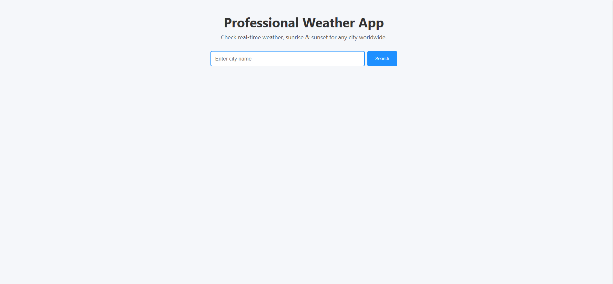
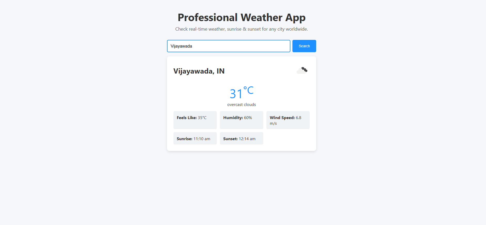

# 🌤️ Professional Weather App

This is a sleek, responsive, and modern **Weather App** built with HTML, CSS, and JavaScript. It fetches real-time weather data for any city in the world using the [OpenWeatherMap API](https://openweathermap.org/api). The app shows current weather, temperature, wind speed, humidity, and sunrise/sunset timings.

## 🔍 Features

- 🔎 Search for any city worldwide  
- 🌡️ Displays current temperature in Celsius  
- 🌤️ Real-time weather conditions with icons  
- 💨 Wind speed, 🌅 Sunrise & 🌇 Sunset timings  
- 📱 Fully responsive (mobile-first design)  
- 🚫 Error handling for invalid input or network failure  

## 📷 Screenshot

## 🚀 Live Demo

[Click here to view the live app]( https://dondapati-theerdha-purushotham.github.io/Weather-app/)

## 🛠️ Tech Stack

- **HTML5** – Semantic structure  
- **CSS3** – Modern layout & styling  
- **JavaScript (ES6)** – DOM manipulation and API interaction  
- **OpenWeatherMap API** – Live weather data  

## 🔑 Getting Started

### 📦 Installation

1. **Clone this repository:**
   git clone https://github.com/DONDAPATI-THEERDHA-PURUSHOTHAM/Weather-app.git
   cd weather-app
Get a free API key from OpenWeatherMap

Replace API key
Open script.js and replace the line:

const API_KEY = 'your_api_key_here';
Run the app
Open index.html in your browser, or use Live Server in VSCode.

📂 Project Structure

weather-app/
├── index.html          # Main HTML layout
├── style.css           # Styling and responsiveness
├── script.js           # Core JavaScript functionality
├── README.md           # Read the project for better understanding
├── wea.png             # Display image
└── wea1.png            # Report Image

🧪 Sample Cities to Test
London
Tokyo
Hyderabad
New York
Sydney

✅ Future Enhancements
📍 Geolocation-based weather fetching
🕒 Hourly / Weekly forecast
🌧️ Background effects for weather types
🎨 Theme switch (light/dark mode)

🙌 Acknowledgements

OpenWeatherMap API
Icons provided by OpenWeather

🧑‍💻 Author
Dondapati Theerdha Purushotham
📧 Email: dtpurushotham2005@gmail.com
🌐 LinkedIn: www.linkedin.com/in/dondapati-theerdha-purushotham-23kn1a4287
🌐 Instragram:https://www.instagram.com/velociraptor_alert_bulwark9

📄 License
This project is licensed under the MIT License.

“Knowing the weather keeps you prepared. Building a weather app keeps you ahead.” — 💡
